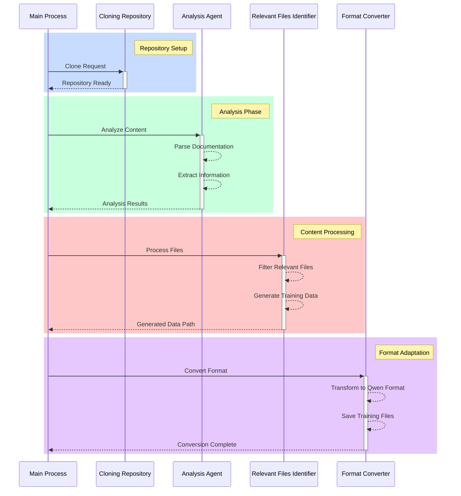

# 🚀 RepoWhisperer: Your repository's wisdom, distilled for LLMs

## 📜 Repository Purpose
RepoWhisperer is a specialized tool that leverages AutoGen's multi-agent system to analyze code repositories and generate synthetic training data specifically formatted for Qwen 2.5 Coder fine-tuning. By utilizing Ollama to access Qwen's capabilities, this project creates high-quality training datasets that follow the official Qwen repository's formatting requirements.

## 🤖 Agent System Overview
The system employs a coordinated team of specialized agents:
- **Repository Cloner**: A pure Python implementation for cloning target repositories into the "coding" folder
- **Analysis Agent**: An AutoGen-powered agent that examines repository content and documentation, producing structured JSON analysis
- **Relevant Files Identifier**: A specialized component that identifies and processes relevant files for training data generation
- **Format Converter**: Transforms analysis results into Qwen's specific training formats

### 📦 Agent Interactions



## 🗂️ Repository Structure
```
RepoWhisperer/
├── agents/
│   ├── analysis_agent.py       # Repository content analyzer
│   ├── cloning_repository.py   # Repository download manager
│   ├── format_converter_agent.py # Qwen format converter
│   └── relevant_files_agent.py # File relevance analyzer
└── main.py                     # Application entry point
```

## 📊 Generated Training Data
The system produces two types of training data files:

1. **Code Snippets for Fine-tuning**:
   - Location: `coding/synthetic_data/qwen_to_train_*.txt`
   - Format:
   ```text
   <reponame>repository_name
   <file_sep>path/to/file
   actual_code_content
   ```

2. **Q&A Pairs for Training**:
   - Location: `coding/synthetic_data/qwen_format_*.jsonl`
   - Format:
   ```json
   {
     "messages": [
       {
         "role": "system",
         "content": "You are a helpful coding assistant."
       },
       {
         "role": "user",
         "content": "What is the main technology used in this project?"
       },
       {
         "role": "assistant",
         "content": "Based on the repository analysis..."
       }
     ]
   }
   ```

## 🛠️ Quick Start

1. **Environment Setup**:
   ```bash
   # Create environment with specific Python version for Qwen compatibility
   conda create -n repowhisperer python=3.9
   conda activate repowhisperer
   pip install -r requirements.txt
   ```

2. **Run Analysis**:
   ```bash
   python main.py
   ```

3. **Check Generated Data**:
   ```bash
   ls coding/synthetic_data/
   ```

## 🔧 Requirements
- Python 3.9 (aligned with Qwen2.5-coder requirements)
- AutoGen framework for agent orchestration
- Ollama with Qwen2.5-coder model installed
- Git for repository operations

## 👥 Contributing
1. Fork the repository
2. Create your feature branch (`git checkout -b feature/amazing-feature`)
3. Commit your changes (`git commit -m 'Add amazing feature'`)
4. Push to the branch (`git push origin feature/amazing-feature`)
5. Open a Pull Request

## 📝 License
Licensed under the MIT License - see https://mit-license.org/ for details.

## 🙏 Acknowledgments
- The AutoGen team for their excellent agent framework
- Qwen team for their model and training methodologies
- The Ollama project for making models accessible